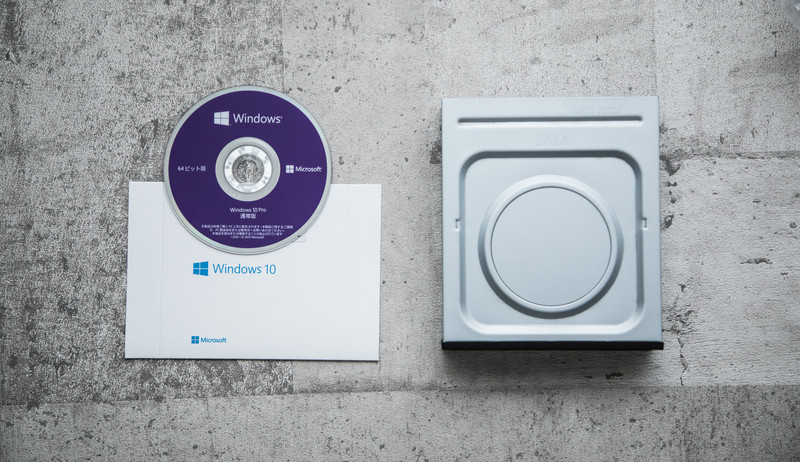

<a href="https://twitter.com/share?ref_src=twsrc%5Etfw" class="twitter-share-button" data-show-count="false">Tweet</a>

# Operating System(OS)
## OSとは

## Linux

* Linuxとは

読み：リナックス 
略称：Linus UNIXという芬蘭の開発者Linusの名が入った説やLinux Is Not UNIXという再帰的頭字語という説が。。。

様々なディストリビューション（種類というイメージでOK）がありますが、ここではRedHat系（RHEL、CentOS）を中心に書いていきます。
（基本は同じなので何でも良いです）

* インストールしてみよう
  * [インストール方法](https://yusuoo.github.io/RTFSE/OperatingSystem(OS)/Linux/インストール方法/)

* コマンド
順不同で記載。頻繁に使うものを纏めている。
  * vim
  
  
* こんなときどうする？
* 

## Mac
## Windows
